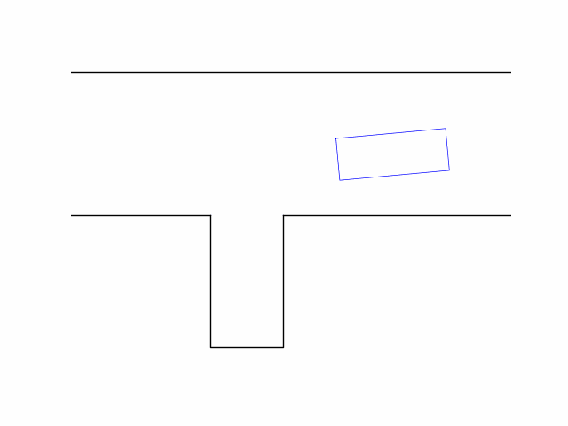
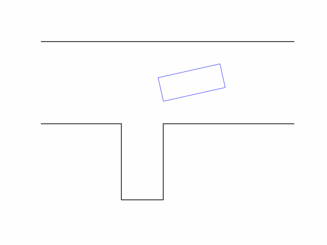
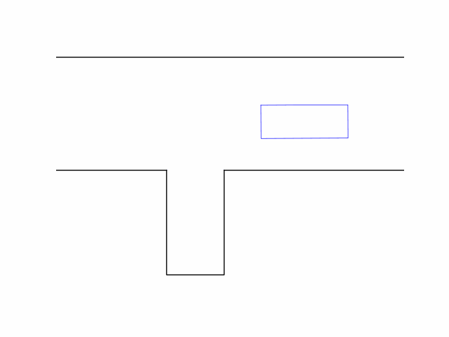
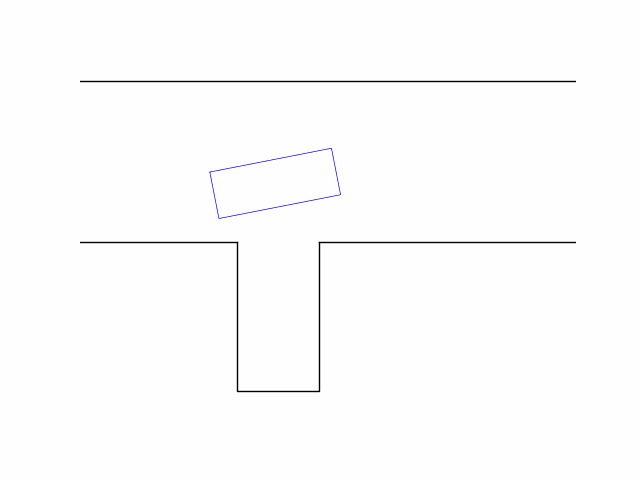
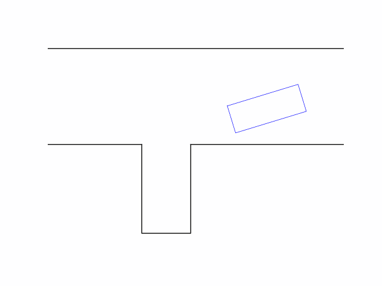
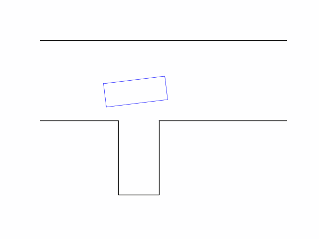
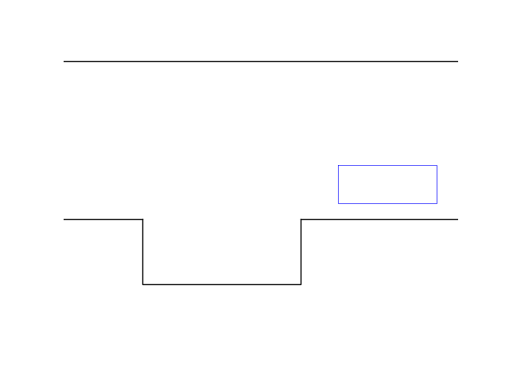
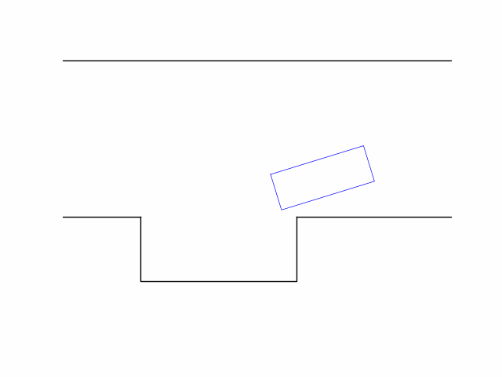

# Reinforced Automatic Parking

Here, I showcase my internship project at Bosch China - "Reinforced Automatic Parking."

For now. the complete code cannot be shared, but I'll present project details and simulation results using Markdown files. Stay tuned for updates! 🚗💨


## Reinforcement Learning (RL)

- Trial and error learner, inspired by animal behavior
- Featured with repeated interaction with environment


## Environment

#### vehicle model

- a kinematic model is enough for the low speed situation

  

  transition function:
  ```math
  \left[\begin{array}{c}
  \dot{x}\\\dot{y}\\\dot{\theta}
  \end{array}\right]=
  \left[\begin{array}{c}
  v\cdot\cos\theta\\v\cdot\sin\theta\\v\cdot\tan\varphi/L
  \end{array}\right]
  ```

- vehicle parameters: length, width, axle to rear bumper, wheelbase

- state space

  Here, $v, \varphi$ are augumented to the state vector. We use their increments as the action to improve the smoothness of control.
  
  | variable  |  description   |        range        |
  | :-------: | :------------: | :-----------------: |
  |     x     |   coordinate   |      [-15, 15]      |
  |     y     |   coordinate   |      [-10, 10]      |
  | $\theta$  | heading angle  |   [-$\pi$, $\pi$]   |
  |     v     |    velocity    |       [-1, 1]       |
  | $\varphi$ | steering angle | [-$\pi/5$, $\pi/5$] |


- action space

  |     variable     |      description      |        range        |
  | :--------------: | :-------------------: | :-----------------: |
  |        a         |     acceleration      |       [-2, 2]       |
  | $\Delta \varphi$ | steering angular rate | [-$\pi/5$, $\pi/5$] |

  

#### parking lot configuration

- parallel parking


- vertical parking


#### constraints

- collision constraints with surrounding walls and obstacles (stationary cars)

- terminal constraints

  | terminal state | expectation (parallel) | expectation (vertical) | admissible error |
  | :------------: | :--------------------: | :--------------------: | :--------------: |
  |       x        |           0            |           0            |      0.1 m       |
  |       y        |           0            |           0            |      0.1 m       |
  |    $\theta$    |           0            |        $\pi/2$         |     0.1 rad      |
  |       v        |           0            |           0            |     0.2 m/s      |
  |   $\varphi$    |           -            |           -            |        -         |

  


#### reward function

- terminal reward
  - collision penalty: -10
  - time limit penalty: -10
  - success reward: 10

- terminal reward shaping
  ```math
  cost=(e_x + e_y + e_\theta) \times 5
  ```
  ```math
  reward=10-cost
  ```

**Note**: Why is the penalty for travel distance **unnecessary**? - discount factor $\gamma$.

Recall objective function for RL: 
```math
\mathbb{E}_{\tau\sim p_\theta(\tau)}\{R(\tau)\}
```
```math
R(\tau)=r_0+\gamma\cdot r_1 + \gamma^2\cdot r_2 + \dots + \gamma^T\cdot r_T
```
```math
r_0=r_1=\dots r_{T-1}=0,\quad r_T \text{ is the terminal reward.}\quad \gamma<1
```


## Main Challenge

#### Sparse reward environment

- difficulties in learning

  - exploration. Hard to get positive reward with a randomly initialized NN-parameterized policy, so that the policy can't be updated.
  - reward assignment. Hard to determine which actions (in a long episode) contribute to the success/failure.

- possible solutions

  - reward shaping (e.g. mountain car)

    

  - jump start reinforcement learning (Google AI 2022, ICML 2023)

    


## Implementation details

#### Algorithm: Proximal Policy Optimization (PPO)

- developed by OpenAI; used in training ChatGPT (RL from human feedback)

- on-policy RL; actor-critic architecture

#### Jump start

- for vertical: Initialize the system in the states that are easy to park based on our prior knowledge.
- for parallel: start at the goal state and iteratively expand the start state distribution, assuming reversible dynamic.


## Visualization

#### vertical parking

|                                                              |                                                              |
| ------------------------------------------------------------ | ------------------------------------------------------------ |
|  |  |
|                                                              |                                                              |
|  |  |
|                                                              |                                                              |
|  |  |


#### parallel parking

|                                                              |                                                              |
| ------------------------------------------------------------ | ------------------------------------------------------------ |
|  |  |


