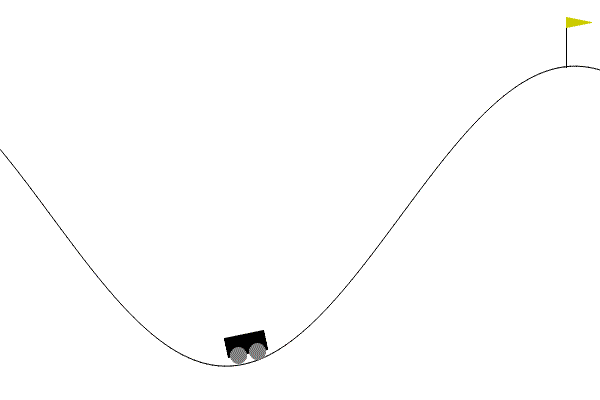

# Reinforced Automatic Parking

Here, I showcase my internship project at Bosch China - "Reinforced Automatic Parking."

For now. the complete code cannot be shared, but I'll present project details and simulation results using Markdown files. Stay tuned for updates! 🚗💨

## Reinforcement Learning (RL)

- Trial and error learner, inspired by animal behavior
- Featured with repeated interaction with environment

## Environment

#### vehicle model

- a kinematic model is enough for the low speed situation

  

- vehicle parameters: length, width, axle to rear bumper, wheelbase

- state space

  The environment context for parking is embedded in the RL environment, so the information of parking lot is not included in states.
  
  | variable  |  description   |        range        |
  | :-------: | :------------: | :-----------------: |
  |     x     |   coordinate   |      [-15, 15]      |
  |     y     |   coordinate   |      [-10, 10]      |
  | $\theta$  | heading angle  |   [-$\pi$, $\pi$]   |
  |     v     |    velocity    |       [-1, 1]       |
  | $\varphi$ | steering angle | [-$\pi/5$, $\pi/5$] |

- action space

  |     variable     |      description      |        range        |
  | :--------------: | :-------------------: | :-----------------: |
  |        a         |     acceleration      |       [-2, 2]       |
  | $\Delta \varphi$ | steering angular rate | [-$\pi/5$, $\pi/5$] |

  

#### parking lot configuration

- parallel parking

- vertical parking

#### constraints

- collision constraints with surrounding walls and obstacles (stationary cars)

- terminal constraints

  | terminal state | expectation (parallel) | expectation (vertical) | admissible error |
  | :------------: | :--------------------: | :--------------------: | :--------------: |
  |       x        |           0            |           0            |      0.1 m       |
  |       y        |           0            |           0            |      0.1 m       |
  |    $\theta$    |           0            |        $\pi/2$         |     0.1 rad      |
  |       v        |           0            |           0            |     0.2 m/s      |
  |   $\varphi$    |           -            |           -            |        -         |

  

#### reward function

- terminal reward
  - collision penalty: -10
  - time limit penalty: -10
  - success reward: 10

## Main Challenge

#### Sparse reward environment

- difficulties in learning

  - exploration. Hard to get positive reward with a randomly initialized NN-parameterized policy, so that the policy can't be updated.
  - reward assignment. Hard to determine which actions (in a long episode) contribute to the success/failure.

- possible solutions

  - reward shaping (e.g. mountain car)

    

  - jump start reinforcement learning (Google AI 2022, ICML 2023)

    

## Current Results

